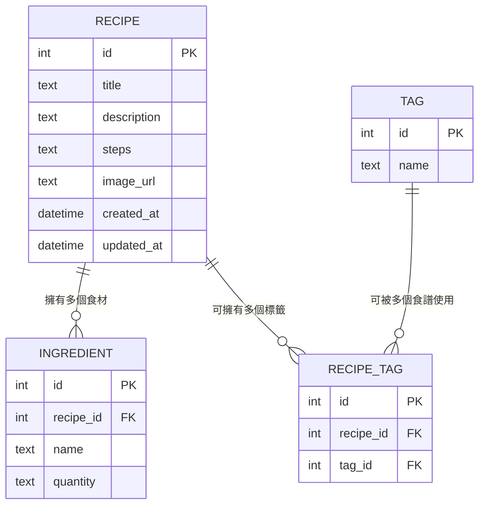

# 資料庫設計文件：食譜管理系統

本文件根據 PRD、系統架構文件與流程圖，定義食譜管理系統的資料庫結構，包含 ER 圖、資料表說明與欄位設計。

---

## 1. ER 圖（實體關係圖）

**關聯說明：**
- **RECIPE ↔ INGREDIENT**：一對多關聯。一個食譜可以有多個食材，每個食材只屬於一個食譜。
- **RECIPE ↔ TAG**：多對多關聯，透過中間表 `RECIPE_TAG` 實現。一個食譜可有多個標籤，一個標籤也可被多個食譜使用。

---

## 2. 資料表詳細說明

### 2.1 RECIPE（食譜）

存放每一筆食譜的基本資訊。

| 欄位名稱     | 型別      | 必填 | 說明                                       |
| ------------ | --------- | :--: | ------------------------------------------ |
| `id`         | INTEGER   |  ✅  | 主鍵，自動遞增 (PK)                        |
| `title`      | TEXT      |  ✅  | 食譜名稱                                   |
| `description`| TEXT      |  ❌  | 食譜簡介或說明文字                         |
| `steps`      | TEXT      |  ✅  | 烹飪步驟（以換行分隔各步驟）               |
| `image_url`  | TEXT      |  ❌  | 食譜圖片路徑（預留未來圖片上傳功能）       |
| `created_at` | TEXT      |  ✅  | 建立時間（ISO 8601 格式，預設為當前時間）  |
| `updated_at` | TEXT      |  ✅  | 更新時間（ISO 8601 格式，預設為當前時間）  |

- **Primary Key**：`id`
- **索引**：`title` 欄位建議建立索引以加速搜尋

---

### 2.2 INGREDIENT（食材）

存放各食譜所需的食材清單，每一筆食材屬於一個食譜。

| 欄位名稱    | 型別    | 必填 | 說明                                  |
| ----------- | ------- | :--: | ------------------------------------- |
| `id`        | INTEGER |  ✅  | 主鍵，自動遞增 (PK)                   |
| `recipe_id` | INTEGER |  ✅  | 所屬食譜的 ID (FK → RECIPE.id)        |
| `name`      | TEXT    |  ✅  | 食材名稱（如：雞蛋、醬油）            |
| `quantity`  | TEXT    |  ❌  | 用量描述（如：2 顆、1 大匙）          |

- **Primary Key**：`id`
- **Foreign Key**：`recipe_id` → `RECIPE(id)`，設定 `ON DELETE CASCADE`（刪除食譜時自動移除相關食材）

---

### 2.3 TAG（標籤）

存放可用的分類標籤（如：前菜、甜點、全素、低卡等）。

| 欄位名稱 | 型別    | 必填 | 說明                          |
| -------- | ------- | :--: | ----------------------------- |
| `id`     | INTEGER |  ✅  | 主鍵，自動遞增 (PK)           |
| `name`   | TEXT    |  ✅  | 標籤名稱（唯一值，不可重複）  |

- **Primary Key**：`id`
- **唯一約束**：`name` 欄位設為 `UNIQUE`

---

### 2.4 RECIPE_TAG（食譜-標籤 關聯表）

多對多中間表，記錄每個食譜所擁有的標籤。

| 欄位名稱    | 型別    | 必填 | 說明                           |
| ----------- | ------- | :--: | ------------------------------ |
| `id`        | INTEGER |  ✅  | 主鍵，自動遞增 (PK)            |
| `recipe_id` | INTEGER |  ✅  | 食譜 ID (FK → RECIPE.id)       |
| `tag_id`    | INTEGER |  ✅  | 標籤 ID (FK → TAG.id)          |

- **Primary Key**：`id`
- **Foreign Key**：`recipe_id` → `RECIPE(id)`，`ON DELETE CASCADE`
- **Foreign Key**：`tag_id` → `TAG(id)`，`ON DELETE CASCADE`
- **唯一約束**：`(recipe_id, tag_id)` 組合唯一，避免重複標記

---

## 3. 設計決策說明

1. **食材獨立成表**：將食材從食譜本體拆出成 `INGREDIENT` 表，使得「用食材推薦食譜」功能可以直接透過 SQL 查詢實現，而非在應用層做字串解析。
2. **標籤多對多設計**：標籤與食譜使用中間表 `RECIPE_TAG` 實現多對多關聯，允許一個標籤被多個食譜共用，節省儲存空間並方便查詢。
3. **時間戳使用 TEXT**：SQLite 沒有原生的 DATETIME 型別，我們使用 TEXT 搭配 ISO 8601 格式字串儲存，兼顧可讀性與排序。
4. **CASCADE 刪除**：刪除食譜時，自動級聯刪除其所有食材與標籤關聯，確保資料一致性。
